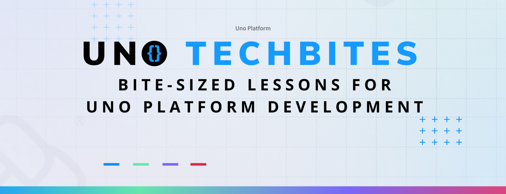

I’m excited to share that [**Uno Platform**](https://platform.uno/) has launched
a brand-new video series called **Uno Tech Bites** 🎥 — short, practical
tutorials designed to help you sharpen your Uno Platform skills without sitting
through long sessions.

Each video is a bite-sized lesson packed with actionable tips you can use right
away in your projects. Whether you’re just getting started with Uno or looking
for ways to go deeper, these videos are designed to fit into your schedule —
perfect for a quick watch on a coffee break or while commuting.

## **What You’ll Find in the Series**

The Uno team has already released **30+ videos** (and counting\!) covering a
wide range of topics:

- Setting up projects with the Uno Platform Template Wizard

- Writing **platform-specific XAML and C\# code**

- Debugging with WSL

- Intro to **C\# Markup** and how to use it with styles and resources

- Implementing controls like **NavBar**, **SafeArea**,
  **DrawerFlyoutPresenter**, and more

- Responsive design with **ResponsiveView** and markup extensions

- Building better UI with **Uno Toolkit** and **lightweight styling**

- Creating dialogs, checking connectivity, and working with the clipboard

- Uno Platform \+ Figma: from plugin setup to custom colors, themes, and
  auto-generated markup

- Mastering **DataBinding** with ExpressionPicker in Uno Platform for Figma
  Plugin

And that’s just a taste — the list continues to grow.

👉 You can explore the full playlist here:  
 [**Uno Tech Bites YouTube Playlist**](https://youtube.com/playlist?list=PLl_OlDcUya9qcdp4SYlEdccD7tIYgb1re&si=pj82-2cJgefcuovE)

## **Why It’s Worth Watching**

What I like most about **Uno Tech Bites** is the format. Each video is compact
but rich in detail, showing not just _what_ to do but _why_ it matters. You
don’t need to set aside hours to learn — you can grab insights in a few minutes
and apply them to your own work the same day.

It’s also refreshing to see the mix of **introductory content** and **advanced
topics**, which makes it easier for developers at different levels to jump in.

## **Join the Conversation**

This series is just the beginning. The Uno team is open to feedback and new
topic ideas, so if there’s something you’d love to learn, you can share your
suggestions on [**Twitter**](https://x.com/UnoPlatform) or in the
[**Uno Discord community**](https://discord.com/invite/XjsmQHdKfq).

Learning is always better when it’s shared — and Uno Tech Bites is a great
example of how small, focused lessons can make a big difference.

So, go ahead and check out the videos.
