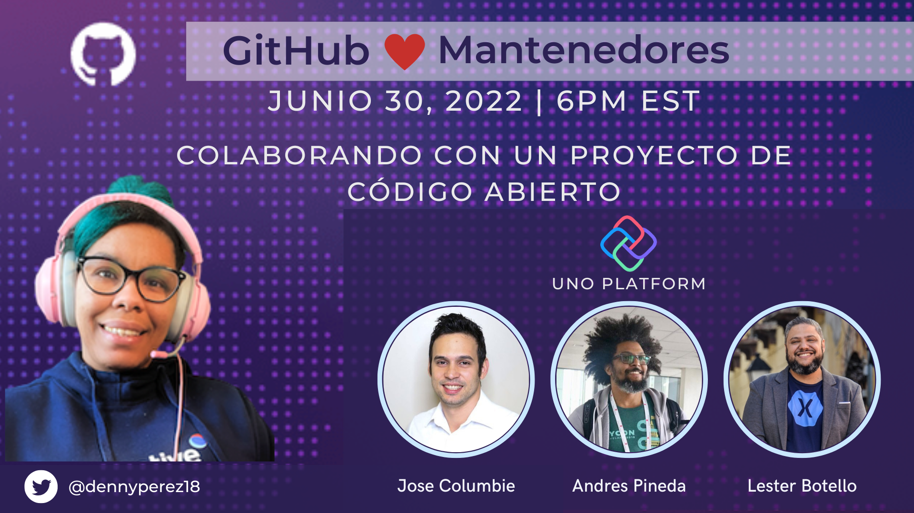

Last week, I had the privilege of hosting an event that was both professional
and personal for me. As part of the **GitHub Leaders** community, I organized
_“Colaborando con un proyecto de código abierto”_ — a panel focused on how to
contribute to open source and why [**Uno Platform**](https://platform.uno/) is
such a welcoming project to start with.

The event took place on **June 30, 2022**, and was streamed live on
[**GitHub’s official YouTube**](https://www.youtube.com/@GitHub) channel as part
of our _GitHub Presents in Spanish_ series. It was an inspiring conversation
featuring developers from Latin America who not only know open source but also
have **hands-on experience working with Uno Platform**.

👉 Event details are available on
[**Meetup**](https://www.meetup.com/gittogether-latam/events/286848667/?utm_medium=referral&utm_campaign=share-btn_savedevents_share_modal&utm_source=link&utm_version=v2)**.**

## **Our Panelists 🙌**

I want to thank the three panelists who joined me for this important
conversation:

- [**Andrés Pineda**](https://www.linkedin.com/in/pinedax/) → From the Dominican
  Republic, an application developer passionate about mobile technologies.
  Beyond coding, Andrés contributes as a mentor, organizer, and speaker.

- [**Lester Botello**](https://www.linkedin.com/in/lesterbotello/) → Also from
  the Dominican Republic, a seasoned developer with 15+ years of experience in
  Microsoft technologies. He shared insights on bridging existing skills with
  open source opportunities.

- [**José Columbié**](https://www.linkedin.com/in/josejaviercolumbie/) → From
  Cuba, a Microsoft MVP and DevExpress developer passionate about XAF, XPO,
  Blazor, Xamarin, and Azure. He offered valuable lessons on contributing to Uno
  Platform from a regional and global perspective.

Their collective experience with Uno Platform brought both technical depth and
regional representation, highlighting the strength of Spanish-speaking
contributors in open source.

## **Best Practices We Shared 💡**

While each panelist’s journey was unique, several common best practices emerged
from our conversation:

- **Start small, but start.** Even small documentation or advocacy contributions
  are valuable. Don’t wait until you “know it all.”

- **Follow contribution guidelines.** Reading docs, using proper commit
  messages, and respecting project workflows make collaboration smoother for
  everyone.

- **Think beyond code.** Translating content, mentoring new developers, or
  writing blog posts are just as impactful as writing features or fixing bugs.

- **Leverage what you already know.** If you’re comfortable with C\# and XAML,
  Uno Platform offers a natural way to contribute while expanding into mobile,
  web, and desktop development.

- **Stay connected.** Engage in discussions on GitHub or community channels.
  Open source is as much about communication as it is about commits.

## **Why This Event Mattered ✨**

For me, this panel was about more than technical practices — it was about
representation and community. Seeing two Dominicans and one Cuban share their
journeys as **Uno Platform contributors** underscored how diverse voices
strengthen open source.

Representation matters. When developers from Latin America show up in global
open source conversations, they inspire others from the region to get involved
too. Uno Platform, with its accessible ecosystem and welcoming community, is a
perfect entry point.

## **Looking Ahead 🚀**

Hosting this conversation reminded me of the importance of creating spaces where
developers can share both their technical knowledge and personal experiences.

If you missed the live session, stay tuned — _GitHub Presents in Spanish_ will
continue to highlight voices from across our community. And if you’ve been
thinking about contributing to open source, let this post be your starting
point. Uno Platform is a great place to put these best practices into action.
