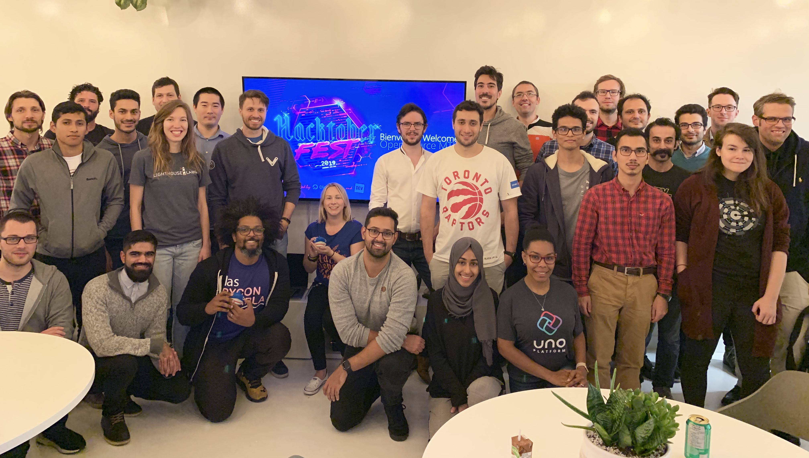
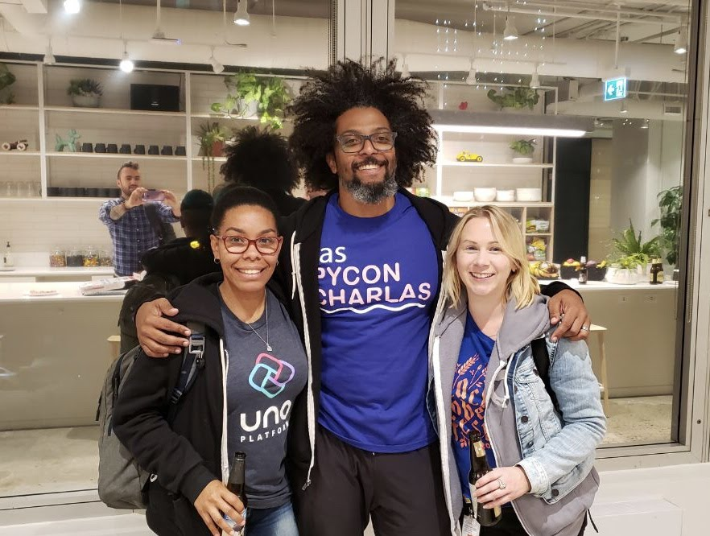

October is always an exciting month for the open-source community because it
brings **Hacktoberfest**, one of the largest events dedicated to celebrating and
contributing to open-source projects. Thousands of developers around the world
come together to write code, improve documentation, and share knowledge — all
with the goal of growing the ecosystem that powers so much of the technology we
use every day.

This year is even more special for me because
[**UNO Platform**](https://platform.uno/) **is participating in Hacktoberfest
for the very first time**.

## **UNO Platform’s First Hacktoberfest 🚀**

We’re excited to announce that **UNO** **Platform** **is** **part** **of**
**Hacktoberfest** **2019\.** Anyone who contributes a pull request to the UNO
Platform on GitHub between **October** **1** **and** **October** **31** will
receive a **UNO Platform T-shirt,** plus some **limited-edition swag**.

Here’s how you can participate:

1. **Register** for Hacktoberfest.

2. **Share your contact details** with the UNO team via the provided form so we
   know where to send your swag once Hacktoberfest ends.

3. **Make a pull request** to improve the project’s code or documentation. No
   contribution is too small — everything is welcome.

4. **Star the repository** on GitHub to show your support:
   [unoplatform/uno](https://github.com/unoplatform/uno).

5. Look for issues labeled **help wanted** or **good first issue**. These are
   specially curated to make it easier for contributors to jump in. The _'good_
   _first issue'_ label is a subset of _'help_ _wanted'_, and it means team
   members are committed to helping first-time contributors every step of the
   way.

This is a great opportunity to contribute to UNO, learn, and be part of the
community while celebrating Hacktoberfest.

## **Celebrating Hacktoberfest in Montreal 🍁**

On **October 9th**, I had the chance to join the
[**osmtl \#3 Hacktoberfest special**](https://opensourcecities.github.io/montreal/events/meetup-october-2019/)
event here in Montreal. It was an evening full of inspiring talks, engaging
conversations, and plenty of opportunities to connect with fellow open source
enthusiasts.

The main talks were hosted by
[**Kim Noel**](https://www.linkedin.com/in/kimcodes/), who covered:

- The history of Hacktoberfest
- An introduction to open source
- A demo on different types of contributions (documentation, code examples, core
  contributions)
- Insights on how to build inclusive open-source communities

Afterwards, attendees gave **lightning talks** — short, five-minute
presentations that added a dynamic, interactive element to the event.

What I enjoyed most was the chance to connect with several leaders of Montreal’s
open source community, and of course, to catch up with my friend **Kim Noel**.
During the networking session, I joined my colleague
[**Andrés Pineda**](https://www.linkedin.com/in/pinedax/) in discussing **UNO
Platform** with attendees, sharing both our perspectives on working with the
project and the excitement of its first Hacktoberfest participation.

And like all great community events, the night ended with **networking over
beers and pizza 🍻🍕** — the perfect way to continue conversations in a relaxed
setting.

A huge thanks to [**Ruy Adorno**](https://www.linkedin.com/in/ruyadorno/) for
creating and hosting this event for the community. It was a fantastic reminder
of how strong and vibrant Montreal’s open source community really is.

## **Final Thoughts**

Hacktoberfest isn’t just about pull requests — it’s about people coming
together, learning, and making open source stronger. Seeing **UNO Platform join
Hacktoberfest for the first time** while also celebrating locally with the
Montreal community made this year extra special for me.

If you haven’t contributed yet, there’s still time. October is far from over,
and open source projects like UNO are always open to your ideas and
contributions.

Let’s keep building together. 💜

## **📌 Useful Links**

- 👉 [Hacktoberfest Registration Page](https://hacktoberfest.com/)

- 👉 [UNO Platform GitHub Repository](https://github.com/unoplatform/uno)

- 👉
  [Good First Issues on UNO GitHub](https://github.com/unoplatform/uno/labels/good%20first%20issue)
