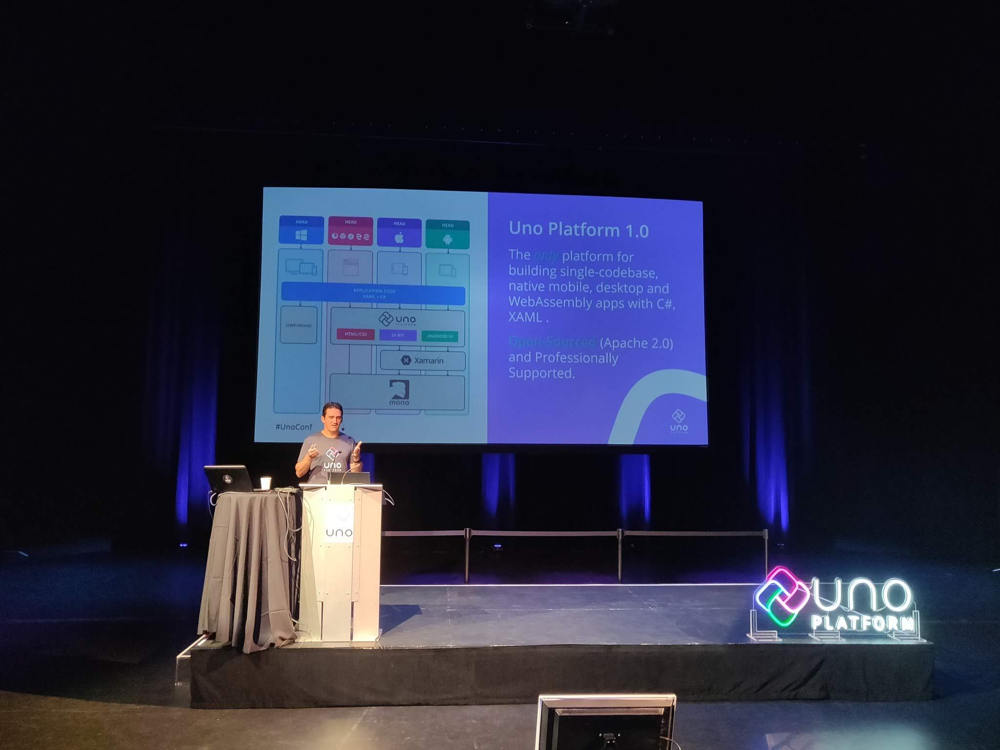

This week, I had the opportunity to attend the very first **UnoConf** — a
two-day event dedicated entirely to **UNO Platform** and the community around
it. As someone who works closely with UNO at **nventive**, being there felt like
a milestone.

From the very first moment, the atmosphere was warm and welcoming. It wasn’t
just about the sessions; it was also about meeting colleagues, connecting with
international speakers, and sharing ideas in a space full of curiosity and
innovation.

## **Day 1 – Keynotes and Talks**

The conference kicked off with a keynote by
[**Miguel de Icaza**](https://www.linkedin.com/in/migueld1/). He took us through
the history of **Mono, Xamarin, and .NET**, weaving technical insights with his
characteristic humor. I had the chance to interact with him for the second time,
and once again I was impressed by his vision and his clear passion for
open-source software. He reminded us that **open source is the key to
innovation**, a theme that resonated throughout the event.

Afterwards, [**Jerome Laban**](https://www.linkedin.com/in/jeromelaban/)
**(CTO)** and
[**Francois Tanguay**](https://www.linkedin.com/in/francoistanguay/) **(CEO)**
of UNO Platform shared the story of UNO’s six-year journey, where it is today,
and where it’s heading. Their talk was packed with announcements that showcased
how fast the platform is evolving.

### **🚀 Announcements from UnoConf 2019**

- **UNO Platform 2.0 released**

- **XAML Hot Reload** support

- **Support for Xamarin.Forms**

- **UI Testing** for UNO Platform

- **SkiaSharp.Extended for WebAssembly**

- **Syncfusion support**, with their first components (Data Grid, Chart,
  Scheduler) available for UNO

- **Windows Community Toolkit** preview of XAML controls for Microsoft Graph,
  extended to run with UNO

It felt like every few minutes, there was something new and exciting being
shared.

The rest of the day was filled with incredible talks:

- **Rocky Lhotka** on building a common business logic layer that works across
  platforms.

- **Billy Hollis** demonstrates creative ways of composing XAML in UNO.

- **Matt Lacey** is previewing a new tool to make working with XAML faster.

- **Mathieu Fillion** shows how to use AdaptiveTriggers for responsive UI.

- **Andres Pineda** shares his open-source contribution journey, encouraging us
  all to get involved.

- **Sam Basu** is experimenting with Telerik UI controls on top of UNO.

Guiding us through the entire day was
[**Jen Looper**,](https://www.linkedin.com/in/jenlooper/) our energetic MC. It
was my first time meeting her, and I was impressed by how she kept the sessions
flowing while also bringing a friendly, community spirit to the event.

## **Day 2 – Hands-On Workshop**

The second day was a more intimate, hands-on workshop led by
[**Geoffrey Huntley**](https://www.linkedin.com/in/geoffreyhuntley/) and
[**Carl De Billy**](https://www.linkedin.com/in/carldebilly/). It was completely
sold out, with 25 attendees diving deep into UNO. What I loved most was how
interactive it felt: people weren’t just listening, they were contributing. A
few pull requests were even completed during the workshop itself\!

The best part? The workshop materials are open-source, so learning doesn’t stop
when the conference ends.

## **The Community Spirit**

Beyond the talks and announcements, what made UnoConf special to me was the
atmosphere. I had the chance to reconnect with colleagues, chat with speakers,
and share ideas with developers from around the world. There was a genuine
spirit of collaboration — the feeling that we’re part of something just
beginning to grow.

## **My Takeaway**

UnoConf 2019 wasn’t just about new features or technology announcements; it was
about **people, ideas, and the future of UNO Platform**. I walked away inspired,
not only by what the platform can do today but also by the vision of where it’s
heading.

As someone who had the chance to see this project up close at nventive, it’s
exciting to now experience the energy of a growing global community around it.

## **Call to Action**

If you couldn’t make it to UnoConf 2019, I encourage you to catch up with the
recap and livestream highlights available on
[platform.uno](https://platform.uno/blog/unoconf-2019-recap-with-video/).
Whether you’re curious about UNO Platform or already experimenting with it, this
is the perfect time to get involved.

This was the first UnoConf, but it’s clear it won’t be the last. I’m already
looking forward to seeing how this community evolves.
